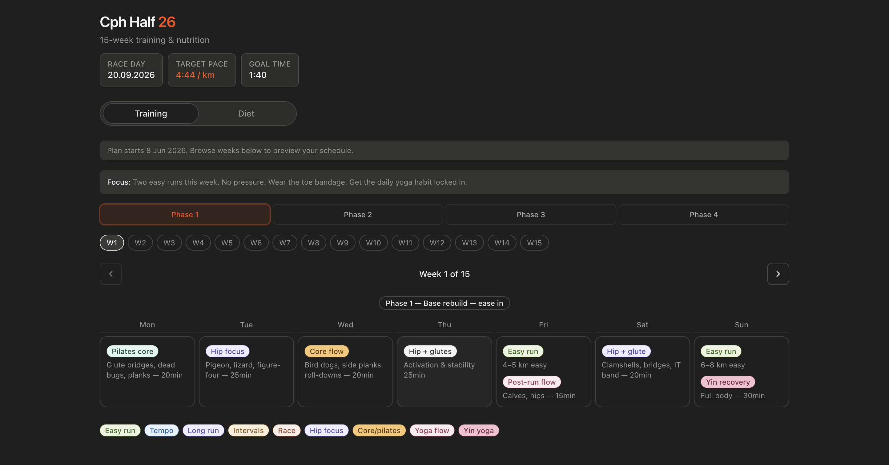

# Cph Half 26

Mobile-first Next.js app for a 15-week half marathon training plan and meal/grocery guide.

[Preview](https://cph-half26.vercel.app/)



## Stack

- Next.js 15 (App Router)
- React 19
- Tailwind CSS 4
- Radix UI primitives (tabs, scroll area)
- date-fns

## Develop

```bash
pnpm install
pnpm dev
```

Open [http://localhost:3000](http://localhost:3000).

## Build

```bash
pnpm build
pnpm start
```

## License

This project is licensed under the MIT License. See `LICENSE.md` for details.
